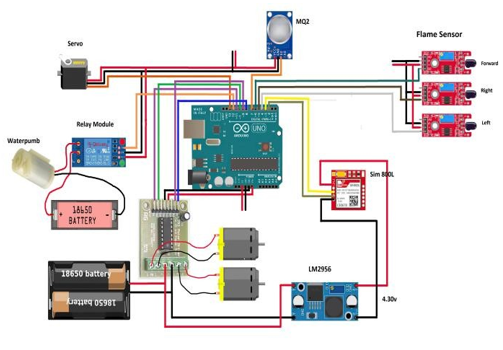
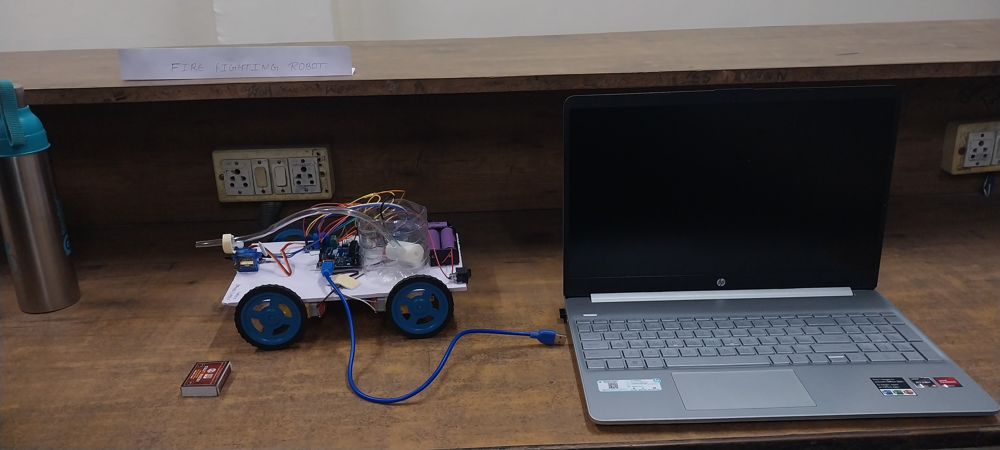
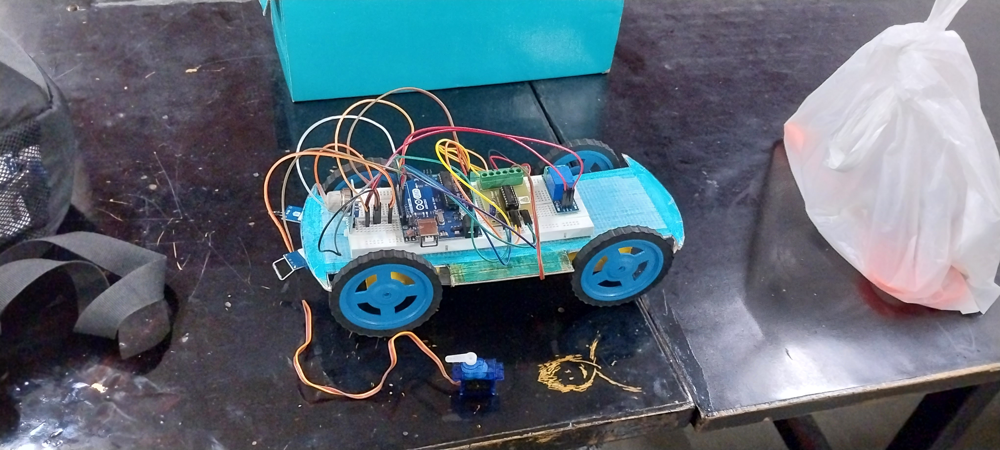

# 🔥 Autonomous Fire-Fighting Robot

Arduino-based autonomous robotic system designed to detect and extinguish small-scale indoor fires using multi-sensor integration and real-time embedded control logic.

---

## 📌 Project Overview

This project presents a low-cost, embedded fire detection and suppression robot capable of:

- 🔍 Detecting fire within **25–30 cm**
- ⚡ Responding in **2–3 seconds**
- 💧 Extinguishing flames within **1–2 attempts**
- 🤖 Navigating autonomously using sensor-based logic

Designed and implemented using Arduino, L298 motor driver, flame sensors, gas sensors, servo mechanism, and water pump control.

---

## 🧠 Problem Statement

Fire emergencies require rapid response while minimizing human risk.  
This project develops an autonomous robotic system capable of detecting and suppressing indoor fire without human intervention.

---

## 🏗️ System Architecture

### 🔹 Block Diagram

### 🔹 Circuit Diagram

---

## 🔧 Hardware Components

- Arduino UNO
- L298N Motor Driver
- 3 Flame Sensors (Left, Front, Right)
- MQ2 Gas Sensor
- Ultrasonic Sensor
- SG90 Servo Motor
- Mini Water Pump
- DC Motors + Wheels
- Relay Module
- Chassis & Battery Pack

---

## ⚙️ Working Logic

1. Sensors continuously monitor flame intensity.
2. If flame detected:
   - Robot stops
   - Activates water pump
   - Servo sweeps nozzle direction
3. If no fire:
   - Robot navigates using conditional logic
   - Adjusts movement (Forward / Left / Right / Backward)

Control implemented using Embedded C (Arduino IDE).

---

## 📂 Project Structure

Autonomous-Fire-Fighting-Robot
│
├── 📂 block-diagram
│   └── block_diagram.png
│
├── 📂 circuit-diagram
│   └── circuit_diagram.png
│
├── 📂 code
│   └── fire_fighting_robot.ino
│
├── 📂 images
│   ├── robot_front_view.jpg
│   └── robot_top_view.jpg
│
├── 📂 demo
│   └── demo_link.txt
│
└── README.md

### 📌 Folder Description

- **block-diagram/** → System architecture overview  
- **circuit-diagram/** → Hardware wiring connections  
- **code/** → Arduino embedded control logic  
- **images/** → Robot visuals (front & top view)  
- **demo/** → Demonstration video link  

---

## 📸 Robot Images

### 🔹 Front View

### 🔹 Top View

---

## 🎥 Demo Video

Final Structure Link: *(https://drive.google.com/file/d/1DX1uqiA_QuCPiQYGvBv-pxTQHsugg_2r/view?usp=sharing)*

Demo Link: *(https://drive.google.com/file/d/194iEqIM6P0hewS7NzqkATR1v3pVAi7m6/view?usp=sharing)*

---

## 📊 Performance Metrics

| Metric | Value |
|--------|-------|
| Detection Range | 25–30 cm |
| Response Time | 2–3 sec |
| Extinguish Attempts | 1–2 |
| Control Type | Fully Autonomous |

---

## 🚀 Future Improvements

- Integration with IoT for remote monitoring
- Thermal camera integration
- Real-time mobile app alert system
- Obstacle avoidance optimization
- Machine Learning based fire intensity prediction

---

## 👨‍💻 Author

**Om Pandey**  
B.Tech CSE (Robotics)  
Lovely Professional University  
AI | ML | Robotics Enthusiast  

GitHub: https://github.com/ompandeyin

